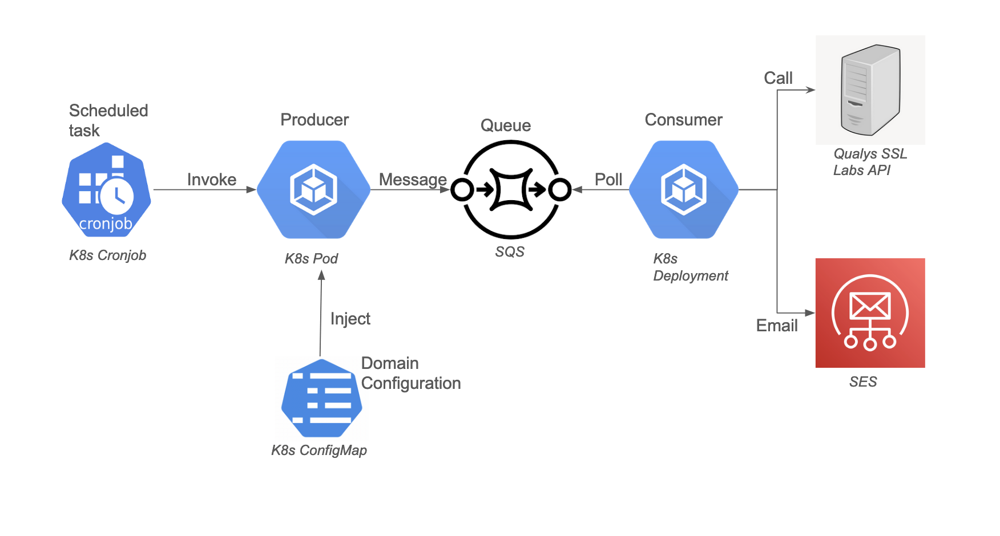

# Overview
This Project uses Qualys SSL Labs API to receive up to date SSL scan results for a website. As of today, the hostname that we will be running this scan on is hardcoded as a variable in the main.go file, but we can inject this as an environment variable in the future. The output of the scan is a csv file that will be created at `/tmp/ssl-scan.csv`. The hope is to be able to expand on this in the future by configuring email notifications / alerting based on this output.

# How to run locally
We can use docker to build and run this project locally. The only tricky part to keep in mind is this script generates a csv file, which is lost when are container terminates. For that reason we need to set up a volume mount between our container and host machine. We can run the following commands to run this program locally:
```
docker build . -t ssl-scanner
docker run --rm -v /tmp:/tmp ssl-scanner
```
After running this we should have the results in a cvs file under `/tmp/ssl-scan.csv`

# Q/A
**Q)** How would you scale this script and run it with resiliency to e.g. handle 1000s of domains?

**A)** The scalability and resiliency of this application would largely come from how we deploy this script. One way would be to use a queue to handle the execution. Basically, the script would be split to have a producer part and a consumer part. The producer, which can run as a sceduled task (ie once a day), would just populate the queue with messages; creating one message per domain we want to scan. And the consumers would read the message and execute this script using the hostname that was pulled off the message. We would need to implement rate limiting logic / retry logic, but that is largely supported even today since we know the max and current assessments directly from Qualys SSL Labs API. Below are two different ways we can implement this type of solution, allowing us to have a scalable and resilient system.




**Q)** How would you monitor/alert on this service?

**A)** There are multiple ways to monitor the application based on the two different designs above. But a very common way, which would work for both patterns is to use Datadog. Datadog has a lot of out of the box monitoring for applications deployed in Kubernetes and/or AWS. For example, for SQS we can use a DLQ whenever messages fail to be processed (ie consumer never pulled the message or never acknowledged a message), and Datadog can send an alert whenever we have messages in our DLQ. We can even have our compute instance (ie Lambda function or Kubernetes pod) send custom metrics to Datadog and do alerting based on that. For example, this scanning tool may be running scans on dev, test, staging, and production domains for the company. And it may be okay if the tool breaks while running a scan on a dev / test domain, but it is not okay for the tool to break on staging / production domains. We can send custom metrics to Datadog which are tagged with the environment, and send alerts only when the domain in question is important. 

**Q)** What would you do to handle adding new domains to scan or certificate expiry events from your service?

**A)** As long as we externalize the environment variables (ie AWS SSM Parameter or K8s ConfigMap) we can very easily handle adding new domains. We would not need to change the code, but instead just make the change to the platform that is holding the configuration. Note, as of today this is not done because it is simpler to hardcode the domain. In terms of handling certificate expiry events, this would ideally be a fairly easy add-on. We already figure out if the Certificate is expired from inside the code base today. We would modify this logic to figure out if the certificate is expiring within the next 30(?) days and send an email via SES, which is already part of the design, if the condition is met.

**Q)** After some time, your report requires more enhancements requested by the Tech team of the company. How would you handle these "continuous" requirement changes in a sustainable manner?

**A)** As with most applications, I would come up with a CI/CD process to automatically build and deploy any changes we may need to make. There are many tools that can orchestrate this such as Jenkins, Github Actions, Travis CI, and AWS Codepipelines. Additionally, depending on the platform we pick (ie K8s or AWS), the steps involved to release the application will be different. For example, using the AWS design we can actually manage this entire stack using terraform. Terraform would not only manage the infrastructure (ie SQS, CloudWatch Event, SES) but it could deploy a new version of our codebase to Lambda whenever we update it. If we are using Kubernetes, we can do a simple build / deploy, which is just a bash script that runs docker / kubernetes commands, or use more complex solutions such as ArgoCD. 